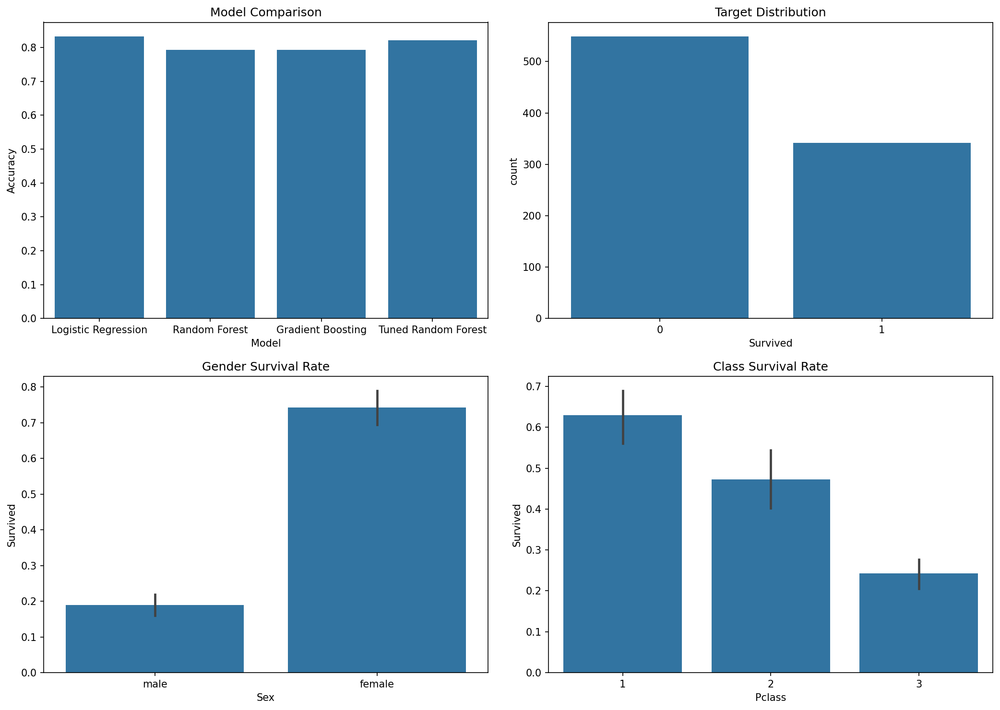

# AI/ML Internship — Week 8 Capstone Project

## Author

Mirza Qasim

## Project Title

Titanic Survival Prediction using Machine Learning

---

## Project Overview

This capstone project focuses on predicting passenger survival on the Titanic using Machine Learning techniques. The project implements a complete end-to-end machine learning workflow including data preprocessing, feature engineering, model training, hyperparameter tuning, model evaluation, prediction generation, and deployment preparation.

The objective is to identify the most effective machine learning model for predicting whether a passenger survived based on demographic and travel-related information.

---

## Dataset

### Titanic Dataset

Files Used:

* train.csv
* test.csv

The dataset contains passenger information including:

* Passenger Class (Pclass)
* Name
* Sex
* Age
* SibSp
* Parch
* Ticket
* Fare
* Cabin
* Embarked

### Target Variable

* Survived

  * 0 = Did Not Survive
  * 1 = Survived

---

## Project Objectives

* Perform Exploratory Data Analysis (EDA)
* Handle Missing Values
* Engineer New Features
* Build Machine Learning Pipelines
* Train Multiple Classification Models
* Tune Hyperparameters using GridSearchCV
* Compare Model Performance
* Generate Predictions for Unseen Data
* Save and Reuse the Best Model
* Prepare for Deployment

---

## Technologies Used

* Python
* NumPy
* Pandas
* Matplotlib
* Seaborn
* Scikit-Learn
* Joblib

---

## Feature Engineering

The following custom features were created:

### FamilySize

FamilySize = SibSp + Parch + 1

Represents the total number of family members traveling together.

### IsAlone

Binary feature indicating whether a passenger was traveling alone.

### Title Extraction

Titles such as:

* Mr
* Mrs
* Miss
* Master

were extracted from passenger names to provide additional demographic information.

---

## Data Preprocessing

The preprocessing pipeline included:

### Numerical Features

* Median Imputation
* Standard Scaling

### Categorical Features

* Missing Value Imputation
* One-Hot Encoding

Pipeline Components:

* SimpleImputer
* StandardScaler
* OneHotEncoder
* ColumnTransformer
* Pipeline

---

## Models Implemented

### 1. Logistic Regression

Validation Accuracy:

**83.24%**

---

### 2. Random Forest Classifier

Validation Accuracy:

**79.33%**

---

### 3. Gradient Boosting Classifier

Validation Accuracy:

**79.33%**

---

### 4. Tuned Random Forest (GridSearchCV)

Validation Accuracy:

**82.12%**

---

## Model Comparison

| Model               | Accuracy |
| ------------------- | -------- |
| Logistic Regression | 83.24%   |
| Random Forest       | 79.33%   |
| Gradient Boosting   | 79.33%   |
| Tuned Random Forest | 82.12%   |

---

## Best Model

### Logistic Regression

Final Validation Accuracy:

**83.24%**

Reasons for Selection:

* Highest validation accuracy
* Strong precision and recall
* Good generalization performance
* Computationally efficient
* Easy to interpret

---

## Generated Files

### Prediction File

submission.csv

Contains predicted survival values for the Titanic test dataset.

### Saved Model

titanic_best_model.pkl

Serialized model file for future use and deployment.

### Dashboard

Visual summary of model performance and dataset insights.

---

## Key Insights

### Gender

Female passengers had a significantly higher survival rate than male passengers.

### Passenger Class

First-class passengers showed a much higher probability of survival.

### Fare

Passengers paying higher fares generally had better survival outcomes.

### Family Relationships

Family size and travel companionship influenced survival probability.

---

## Project Workflow

1. Data Loading
2. Data Exploration
3. Missing Value Analysis
4. Feature Engineering
5. Data Preprocessing
6. Train-Test Split
7. Logistic Regression
8. Random Forest
9. Gradient Boosting
10. Hyperparameter Tuning
11. Model Comparison
12. Prediction Generation
13. Model Saving
14. Dashboard Creation
15. Final Evaluation

---

## Conclusion

This project successfully demonstrates a complete machine learning workflow for solving a real-world classification problem. Through data preprocessing, feature engineering, model development, and evaluation, Logistic Regression achieved the best performance with an accuracy of 83.24%.

The project highlights the importance of data preparation, feature engineering, and model selection in building accurate predictive systems and serves as the final capstone project of the AI/ML Internship Program.
